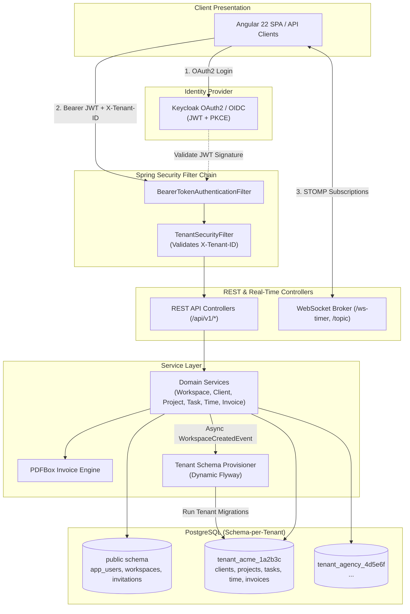
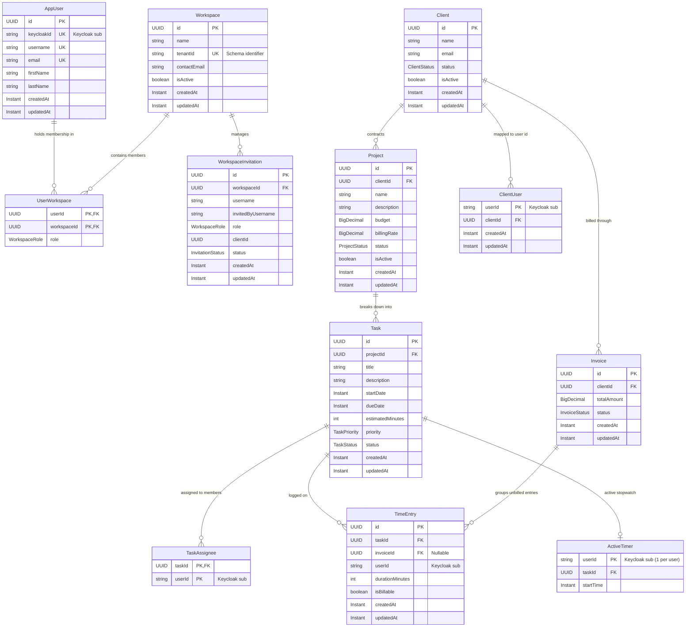
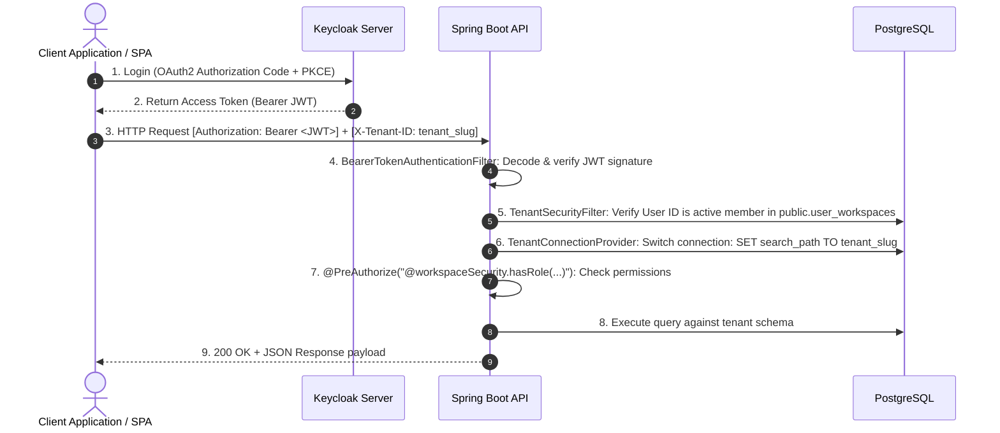

# Agency OS — Back-End API

[](https://openjdk.org/)
[](https://spring.io/projects/spring-boot)
[](https://www.postgresql.org/)
[]()
[]()

> **Agency OS API** is an enterprise-ready, multi-tenant RESTful backend and real-time WebSocket server built with **Java 21** and **Spring Boot 4.1**. It powers agency operations including client relationship management (CRM), project scoping, task workflows, live stopwatch time logging, and automated PDF invoice generation with strict database schema-level multi-tenancy.

---

## Table of Contents

- [Core Capabilities](#-core-capabilities)
- [Tech Stack & Dependencies](#-tech-stack--dependencies)
- [System Architecture](#-system-architecture)
- [Domain Model & Entity Relationships](#-domain-model--entity-relationships)
- [Complete REST API Reference](#-complete-rest-api-reference)
  - [1. Workspaces (`/api/v1/workspaces`)](#1-workspaces-apiv1workspaces)
  - [2. Workspace Invitations (`/api/v1/workspaces`)](#2-workspace-invitations-apiv1workspaces)
  - [3. Clients (`/api/v1/clients`)](#3-clients-apiv1clients)
  - [4. Projects (`/api/v1/projects`)](#4-projects-apiv1projects)
  - [5. Tasks (`/api/v1/tasks`)](#5-tasks-apiv1tasks)
  - [6. Time Tracking (`/api/v1/time-entries`)](#6-time-tracking-apiv1time-entries)
  - [7. Invoices (`/api/v1/invoices`)](#7-invoices-apiv1invoices)
- [Multi-Tenancy Implementation](#-multi-tenancy-implementation)
- [Security & Authentication](#-security--authentication)
  - [OAuth2 Authentication Flow](#oauth2-authentication-flow)
  - [Role-Based Access Control (RBAC) Matrix](#role-based-access-control-rbac-matrix)
- [Real-Time WebSocket Engine](#-real-time-websocket-engine)
- [Automated PDF Invoice Generation](#-automated-pdf-invoice-generation)
- [Database Schema & Migrations](#-database-schema--migrations)
- [Package Layout](#-package-layout)
- [Getting Started & Configuration](#-getting-started--configuration)
- [Testing & Quality Gates](#-testing--quality-gates)
- [CI/CD & Deployment](#-cicd--deployment)
- [Documentation Reference](#-documentation-reference)

---

## Core Capabilities

| Capability | Description |
|---|---|
| **Multi-Tenancy** | Schema-per-tenant isolation (`tenant_<slug>_<suffix>`) ensuring 100% data separation between client workspaces. |
| **Workspace Management** | Create isolated organizations, invite teammates by email/username, and manage role-based memberships. |
| **Client CRM** | Track client accounts with lifecycle stages (`PROSPECT`, `ACTIVE`, `INACTIVE`) and mapped external client portal logins. |
| **Project Management** | Plan projects with fixed budgets, hourly billing rates (`billingRate`), delivery statuses, and client-scoping. |
| **Task Backlog & Board** | Create tasks with assignees, priority workflows (`LOW` → `URGENT`), due dates, and budget health calculations. |
| **Live Time Tracking** | Log hours manually or run live stopwatch timers broadcasting real-time updates across team dashboards via WebSockets. |
| **Automated Invoicing** | Aggregate unbilled billable hours, compute amounts from project hourly rates, and generate print-ready branded PDF invoices. |
| **Enterprise Security** | Keycloak OpenID Connect / OAuth2 Resource Server validation with PKCE and SpEL method-level authorization. |

---

## Tech Stack & Dependencies

- **Language & Runtime**: Java 21 (Eclipse Temurin)
- **Framework**: Spring Boot `4.1.0`
  - `spring-boot-starter-data-jpa`: Spring Data JPA & Hibernate
  - `spring-boot-starter-security`: Spring Security Core
  - `spring-boot-starter-security-oauth2-resource-server`: Keycloak JWT token validation
  - `spring-boot-starter-webmvc`: REST APIs
  - `spring-boot-starter-websocket`: STOMP/WebSocket message broker
  - `spring-boot-starter-validation`: Jakarta Bean Validation
  - `spring-boot-starter-flyway`: Database migrations
- **Database**: PostgreSQL 15+ (`org.postgresql:postgresql`)
- **PDF Engine**: Apache PDFBox `3.0.2`
- **Documentation**: SpringDoc OpenAPI `3.0.3` (Swagger UI)
- **Build Tool**: Apache Maven (with `mvnw` wrapper)
- **Quality Gates**: JaCoCo (≥80% line coverage), Spotless (Google Java Format 1.17), Checkstyle, SonarQube

---

## System Architecture



---

## Domain Model & Entity Relationships



---

## Complete REST API Reference

> **Authentication**: All endpoints require `Authorization: Bearer <JWT>` from Keycloak.  
> **Multi-Tenancy**: All non-global endpoints require `X-Tenant-ID: <tenantId>` in the request headers.

### 1. Workspaces (`/api/v1/workspaces`)

| Method | Path | Required Role | Description |
|---|---|---|---|
| `POST` | `/api/v1/workspaces` | Authenticated User | Create a new tenant workspace organization (caller becomes `OWNER`) |
| `GET` | `/api/v1/workspaces` | Authenticated User | List all workspaces where the current user holds membership |
| `PUT` | `/api/v1/workspaces/{tenantId}` | `OWNER` | Update workspace metadata and contact email |
| `DELETE` | `/api/v1/workspaces/{tenantId}` | `OWNER` | Soft-delete workspace organization |
| `GET` | `/api/v1/workspaces/{tenantId}/members` | `OWNER`, `ADMIN` | List all members and their assigned workspace roles |
| `PUT` | `/api/v1/workspaces/{tenantId}/members/{userId}` | `OWNER`, `ADMIN` | Update a member's role (cannot modify `OWNER`) |
| `DELETE` | `/api/v1/workspaces/{tenantId}/members/{userId}` | `OWNER`, `ADMIN` | Remove a member from the workspace |
| `POST` | `/api/v1/workspaces/{tenantId}/transfer-ownership` | `OWNER` | Transfer `OWNER` role to another workspace member |

---

### 2. Workspace Invitations (`/api/v1/workspaces`)

| Method | Path | Required Role | Description |
|---|---|---|---|
| `POST` | `/api/v1/workspaces/{tenantId}/invitations` | `OWNER`, `ADMIN` | Send invitation to a user by username or email |
| `GET` | `/api/v1/workspaces/invitations` | Authenticated User | Retrieve all pending invitations for the logged-in user |
| `POST` | `/api/v1/workspaces/invitations/{id}/accept` | Invitee | Accept invitation, provisioning workspace membership |
| `POST` | `/api/v1/workspaces/invitations/{id}/decline` | Invitee | Decline a pending invitation |

---

### 3. Clients (`/api/v1/clients`)

| Method | Path | Required Role | Description |
|---|---|---|---|
| `POST` | `/api/v1/clients` | `OWNER`, `ADMIN` | Create a new client company profile |
| `GET` | `/api/v1/clients` | `OWNER`, `ADMIN`, `MEMBER` | List all client profiles in the current workspace |
| `GET` | `/api/v1/clients/{id}` | `OWNER`, `ADMIN`, `MEMBER` | Get client details by UUID |
| `PUT` | `/api/v1/clients/{id}` | `OWNER` | Update client name, email, or lifecycle status |
| `DELETE` | `/api/v1/clients/{id}` | `OWNER` | Soft-delete client and cascade soft-deletion to projects |

---

### 4. Projects (`/api/v1/projects`)

| Method | Path | Required Role | Scoping Rules / Description |
|---|---|---|---|
| `POST` | `/api/v1/projects` | `OWNER`, `ADMIN` | Create a new project (only `OWNER` can assign client company) |
| `GET` | `/api/v1/projects` | All Workspace Roles | `CLIENT` sees only own company's projects; `MEMBER` sees projects with assigned tasks; `OWNER`/`ADMIN` see all |
| `GET` | `/api/v1/projects/{id}` | All Workspace Roles | Retrieve project by ID with role-based scoping checks |
| `GET` | `/api/v1/projects/client/{clientId}` | `OWNER`, `ADMIN`, `MEMBER` | List all projects belonging to a specific client |
| `PUT` | `/api/v1/projects/{id}` | `OWNER`, `ADMIN` | Update project details (client company re-assignment restricted to `OWNER`) |
| `DELETE` | `/api/v1/projects/{id}` | `OWNER` | Soft-delete project |

---

### 5. Tasks (`/api/v1/tasks`)

| Method | Path | Required Role | Scoping Rules / Description |
|---|---|---|---|
| `POST` | `/api/v1/tasks` | `OWNER`, `ADMIN` | Create a task with assignees, dates, estimated minutes, and priority |
| `GET` | `/api/v1/tasks` | All Workspace Roles | `MEMBER` sees assigned tasks; `OWNER`/`ADMIN` see all tasks |
| `GET` | `/api/v1/tasks/{id}` | All Workspace Roles | Get task by ID (verifies assignment for `MEMBER`) |
| `GET` | `/api/v1/tasks/project/{projectId}` | All Workspace Roles | List tasks under a project |
| `GET` | `/api/v1/tasks/assignee/{assigneeId}`| All Workspace Roles | List tasks assigned to a specific user (`MEMBER` limited to self) |
| `PUT` | `/api/v1/tasks/{id}` | `OWNER`, `ADMIN` | Complete update of task fields |
| `PATCH` | `/api/v1/tasks/{id}/status` | `OWNER`, `ADMIN`, `MEMBER` | Quick workflow status update (`TODO` → `IN_PROGRESS` → `REVIEW` → `DONE`; `MEMBER` restricted to assigned tasks) |
| `DELETE` | `/api/v1/tasks/{id}` | `OWNER`, `ADMIN` | Delete task |

---

### 6. Time Tracking (`/api/v1/time-entries`)

> **Restricted**: `CLIENT` role users are completely blocked from all time-tracking endpoints. Users (`OWNER`, `ADMIN`, `MEMBER`) must be assigned to the target task to log time or run timers.

| Method | Path | Required Role | Description & Real-Time Broadcast |
|---|---|---|---|
| `POST` | `/api/v1/time-entries` | `OWNER`, `ADMIN`, `MEMBER` | Manually log time entry (OWNER/ADMIN can log on behalf of assigned members) → broadcasts to `/topic/{tenantId}/time-entries` |
| `POST` | `/api/v1/time-entries/start/{taskId}` | `OWNER`, `ADMIN`, `MEMBER` | Start stopwatch timer on assigned task (1 active timer per user limit) → broadcasts to `/topic/{tenantId}/timers/start` |
| `POST` | `/api/v1/time-entries/stop` | `OWNER`, `ADMIN`, `MEMBER` | Stop stopwatch timer, compute duration, record `TimeEntry` → broadcasts to `/topic/{tenantId}/timers/stop` |
| `GET` | `/api/v1/time-entries/active` | `OWNER`, `ADMIN`, `MEMBER` | Retrieve currently active running stopwatch timer for logged-in user |
| `GET` | `/api/v1/time-entries/task/{taskId}` | `OWNER`, `ADMIN`, `MEMBER` | List all time entries recorded for a task |
| `GET` | `/api/v1/time-entries/user/{userId}` | `OWNER`, `ADMIN`, `MEMBER` | List all time entries recorded by a user |
| `DELETE` | `/api/v1/time-entries/{id}` | `OWNER`, `ADMIN`, `MEMBER` | Delete a time entry |

---

### 7. Invoices (`/api/v1/invoices`)

| Method | Path | Required Role | Description |
|---|---|---|---|
| `POST` | `/api/v1/invoices` | `OWNER` | Auto-aggregate unbilled billable hours × project rates and generate invoice |
| `GET` | `/api/v1/invoices` | `OWNER`, `ADMIN`, `CLIENT` | List invoices (`MEMBER` locked out; `CLIENT` scoped to own invoices) |
| `GET` | `/api/v1/invoices/{id}` | `OWNER`, `ADMIN`, `CLIENT` | Retrieve invoice details and itemized entries |
| `GET` | `/api/v1/invoices/client/{clientId}` | `OWNER`, `ADMIN` | List all invoices for a specific client |
| `PUT` | `/api/v1/invoices/{id}` | `OWNER` | Update invoice status (`DRAFT`, `SENT`, `PAID`, `OVERDUE`) |
| `DELETE` | `/api/v1/invoices/{id}` | `OWNER` | Delete invoice and release linked time entries back to unbilled state |
| `GET` | `/api/v1/invoices/{id}/pdf` | `OWNER`, `ADMIN`, `CLIENT` | Generate and download print-ready PDF invoice rendered with PDFBox |

---

## Security & Authentication

### OAuth2 Authentication Flow



### Role-Based Access Control (RBAC) Matrix

| Action / Resource | `OWNER` | `ADMIN` | `MEMBER` | `CLIENT` |
|---|:---:|:---:|:---:|:---:|
| **Create / Delete Workspace** | ✓ | X | X | X |
| **Transfer Workspace Ownership** | ✓ | X | X | X |
| **Manage Members & Roles** | ✓ | ✓ | X | X |
| **Send Workspace Invitations** | ✓ | ✓ | X | X |
| **Create & Update Clients** | ✓ | ✓ (Create) | X | X |
| **Create & Update Projects** | ✓ | ✓ | X | X |
| **View Projects** | ✓ All | ✓ All | ✓ Assigned | ✓ Own Company |
| **Create & Update Tasks** | ✓ | ✓ | X | X |
| **Update Task Status** | ✓ | ✓ | ✓ Assigned only | X |
| **View Tasks** | ✓ All | ✓ All | ✓ Assigned | X |
| **Start / Stop Timers & Log Time** | ✓ Assigned tasks | ✓ Assigned tasks | ✓ Assigned tasks | X |
| **Generate & Delete Invoices** | ✓ | X | X | X |
| **View & Download Invoice PDFs** | ✓ | ✓ | X | ✓ Own Company |

---

## Real-Time WebSocket Engine

Agency OS uses **STOMP over WebSocket** with SockJS fallback at `/ws-timer`.

### STOMP Broadcast Topics

| Topic | Trigger | Payload |
|---|---|---|
| `/topic/{tenantId}/time-entries` | Time entry manually created | `TimeEntryResponse` |
| `/topic/{tenantId}/timers/start` | User starts a live stopwatch | `ActiveTimerResponse` |
| `/topic/{tenantId}/timers/stop` | User stops their stopwatch | `TimeEntryResponse` |

`WebSocketAuthChannelInterceptor` decodes Bearer JWTs on `CONNECT` and verifies workspace membership on `SUBSCRIBE` to prevent cross-tenant data leaks.

---

## Automated PDF Invoice Generation

The `InvoicePdfGenerator` uses **Apache PDFBox 3.0.2** to create multi-page, branded, print-ready PDF documents containing:
- Workspace header band & styling
- Net-30 auto-calculated payment terms
- Itemized time entries table with project/task breakdown, hourly rate, and amounts
- Repeating table headers on page-breaks with page numbering (`Page X of Y`)

---

## Database Schema & Migrations

- **Global Track (`db/migration/global`)**: Migrates `public` schema on application boot (`app_users`, `workspaces`, `user_workspaces`, `workspace_invitations`).
- **Tenant Track (`db/migration/tenant`)**: Migrated dynamically on workspace creation via `TenantSchemaProvisioningService` (`clients`, `client_users`, `projects`, `tasks`, `time_entries`, `active_timers`, `invoices`).

---

## Package Layout

```
dev.eyadsharkawy.agency_os_api
├── AgencyOsApiApplication.java          # Spring Boot main class
├── core/
│   ├── config/                          # Jackson, JPA, OpenAPI, WebSocket, Redirect
│   ├── exceptions/                      # GlobalExceptionHandler (RFC 7807), STOMP handler
│   ├── multitenancy/                    # TenantResolver, TenantConnectionProvider, TenantSecurityFilter
│   └── security/                        # SecurityConfig, WebSocketAuthChannelInterceptor, WorkspaceSecurity
├── global/
│   ├── user/                            # AppUser entity & repository
│   └── workspace/                       # Workspace & Invitation entities, services, controllers
├── shared/
│   └── entity/                          # BaseEntity (UUID PK, audit timestamps)
└── tenant/
    ├── client/                          # Client CRM entity, controller, service, repository
    ├── invoice/                         # Invoice entity, controller, service, PDFBox generator
    ├── project/                         # Project entity, controller, service, repository
    ├── task/                            # Task entity, controller, service, repository
    └── time_entry/                      # TimeEntry & ActiveTimer entities, controller, service
```

---

## Getting Started & Configuration

### Prerequisites
- Java 21 (Temurin LTS recommended)
- PostgreSQL 15+
- Keycloak 22+ (Configured with realm & client)
- Maven 3.9+ (or included `./mvnw`)

### Configuration (`.env`)
```bash
cp .env.example .env
```
Fill in `.env`:
```env
DB_URL=jdbc:postgresql://localhost:5432/agency_os
DB_USERNAME=postgres
DB_PASSWORD=your_password
DB_DRIVER=org.postgresql.Driver
CORS_ALLOWED_ORIGINS=http://localhost:4200
PORT=8080
KEYCLOAK_ISSUER_URI=http://localhost:8080/realms/agency-os
KEYCLOAK_FRONTEND_CLIENT_ID=agency-os-frontend
```

### Build & Run
```bash
# Build with tests
./mvnw clean install

# Start Spring Boot application
./mvnw spring-boot:run
```
- API starts at `http://localhost:8080`
- Swagger UI documentation at `http://localhost:8080/swagger-ui/index.html`

---

## Testing & Quality Gates

The backend includes 18 comprehensive test suites:
- **Controller Tests (`@WebMvcTest`)**: `WorkspaceControllerTest`, `ClientControllerTest`, `ProjectControllerTest`, `TaskControllerTest`, `TimeEntryControllerTest`, `InvoiceControllerTest`, `WorkspaceInvitationControllerTest`.
- **Service Tests (Mockito + AssertJ)**: `WorkspaceServiceTest`, `ClientServiceTest`, `ProjectServiceTest`, `TaskServiceTest`, `TimeEntryServiceTest`, `InvoiceServiceTest`, `WorkspaceInvitationServiceTest`, `TenantSchemaProvisioningServiceTest`.
- **Utility Tests**: `InvoicePdfGeneratorTest`, `WorkspaceProvisioningListenerTest`.
- **Context Test**: `AgencyOsApiApplicationTests`.

```bash
# Run tests
./mvnw test

# Verify code formatting and checkstyle
./mvnw spotless:check checkstyle:check

# Auto-format codebase
./mvnw spotless:apply
```

> **Quality Gate**: JaCoCo enforces a **minimum 80% line coverage** requirement on every build.

---

## CI/CD & Deployment

The repository includes a declarative [`Jenkinsfile`](Jenkinsfile) that executes:
1. Spotless & Checkstyle static verification
2. Ephemeral PostgreSQL 15 Docker container integration tests
3. JaCoCo ≥80% coverage check
4. SonarQube quality gate scan
5. Automated production deployment via SSH & rsync

---

## Documentation Reference

- [📐 Deep-Dive Architecture Whitepaper](docs/ARCHITECTURE.md)
- [📡 Complete API Specification & Request/Response Catalog](docs/API.md)
- [🗄 Database Data Model & Schema Guide](docs/DATA_MODEL.md)
- [📮 Postman Collection](docs/agency-os-endpoints.postman_collection.json)
