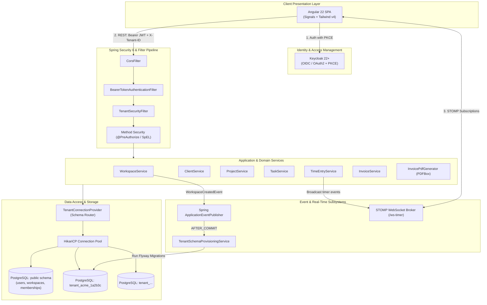
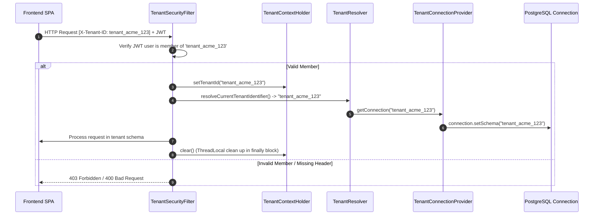
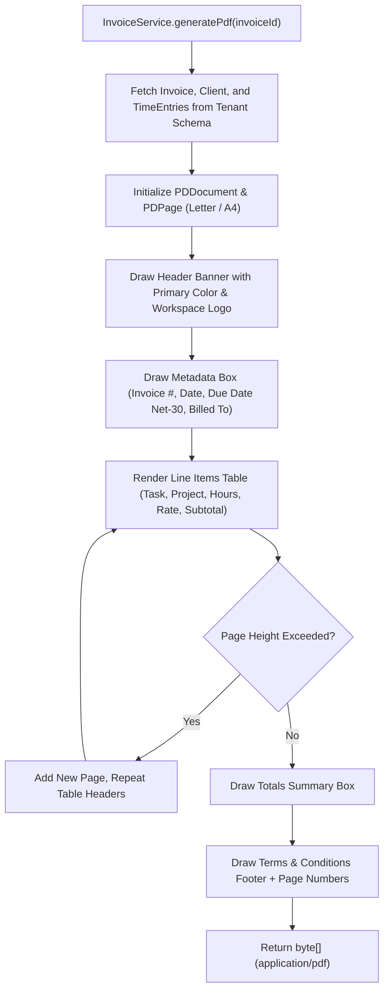

# Agency OS — Architecture Specification

This document details the architectural design, security model, multi-tenancy implementation, real-time messaging pipeline, and asynchronous event mechanisms in **Agency OS API**.

---

## 1. Architectural Principles & Overview

Agency OS is built on three core tenets:
1. **Strict Data Isolation**: No two client workspaces share data tables. All workspace entities reside in isolated PostgreSQL schemas.
2. **Stateless Scalability**: All incoming HTTP and WebSocket requests are authenticated via self-contained, digitally signed JSON Web Tokens (JWT) issued by Keycloak.
3. **Reactive Real-Time Collaboration**: Stopwatch timers and time entry events are broadcast to active team members via STOMP/WebSocket connections.



---

## 2. Multi-Tenancy Architecture

Agency OS uses a **Schema-per-Tenant** multi-tenancy model backed by Hibernate and PostgreSQL.

### 2.1 Why Schema-per-Tenant?
- **Data Security**: SQL queries cannot accidentally leak cross-tenant data because PostgreSQL handles schema partitioning at the catalog level.
- **Maintenance & Compliance**: Individual tenant schemas can be backed up, migrated, or purged independently.
- **Cost Efficiency**: Hundreds of tenants share a single PostgreSQL database instance and connection pool without needing separate databases.

### 2.2 Tenant Lifecycle & Resolution Flow



### 2.3 Key Multitenancy Components

| Class | Location | Purpose |
|---|---|---|
| [`TenantContextHolder`](../src/main/java/dev/eyadsharkawy/agency_os_api/core/multitenancy/TenantContextHolder.java) | `core/multitenancy` | Manages tenant ID in a `ThreadLocal<String>` for the lifetime of a request. |
| [`TenantResolver`](../src/main/java/dev/eyadsharkawy/agency_os_api/core/multitenancy/TenantResolver.java) | `core/multitenancy` | Implements `CurrentTenantIdentifierResolver` to provide Hibernate with current schema. |
| [`TenantConnectionProvider`](../src/main/java/dev/eyadsharkawy/agency_os_api/core/multitenancy/TenantConnectionProvider.java) | `core/multitenancy` | Implements `MultiTenantConnectionProvider` to switch schemas on connection acquisition with SQL-injection sanitization. |
| [`TenantSecurityFilter`](../src/main/java/dev/eyadsharkawy/agency_os_api/core/multitenancy/TenantSecurityFilter.java) | `core/multitenancy` | Intercepts HTTP requests, reads `X-Tenant-ID`, and validates user workspace membership before setting tenant context. |
| [`TenantSchemaProvisioningService`](../src/main/java/dev/eyadsharkawy/agency_os_api/global/workspace/service/TenantSchemaProvisioningService.java) | `global/workspace/service` | Listens for `WorkspaceCreatedEvent` and dynamically executes Flyway migrations against the new tenant schema. |

---

## 3. Security Architecture & Authorization

### 3.1 Authentication
- **Protocol**: OAuth2 Authorization Code Flow with Proof Key for Code Exchange (PKCE).
- **Identity Provider**: Keycloak Server.
- **Tokens**: Stateless signed RS256 JWTs containing `sub` (Keycloak ID), `preferred_username`, `email`, `given_name`, and `family_name`.
- **Validation**: Spring Security's `BearerTokenAuthenticationFilter` validates token signatures against Keycloak's JWKS endpoint (`/.well-known/openid-configuration`).

### 3.2 Authorization Pipeline

```
HTTP Request
    │
    ▼
1. BearerTokenAuthenticationFilter (Validates JWT signature & expiration)
    │
    ▼
2. TenantSecurityFilter (Validates X-Tenant-ID membership against public.user_workspaces)
    │
    ▼
3. Controller Method Invocation
    │
    ▼
4. @PreAuthorize("@workspaceSecurity.hasRole('OWNER', 'ADMIN')")
    │
    ▼
5. Service Layer (Applies business scoping: e.g., CLIENT only views own projects)
    │
    ▼
Database Execution
```

### 3.3 RBAC Helper: `WorkspaceSecurity`
Located at [`WorkspaceSecurity.java`](../src/main/java/dev/eyadsharkawy/agency_os_api/core/security/WorkspaceSecurity.java), this Spring Bean is invoked inside method security annotations:

```java
@PreAuthorize("@workspaceSecurity.hasRole('OWNER', 'ADMIN')")
@PostMapping
public ResponseEntity<ProjectResponse> createProject(@Valid @RequestBody ProjectRequest request) { ... }
```

---

## 4. WebSocket & Real-Time Architecture

### 4.1 Topology
- **Connection Endpoint**: `/ws-timer` (SockJS transport support).
- **Application Destination Prefix**: `/app`.
- **Broker Destinations**: `/topic` and `/queue`.

### 4.2 WebSocket Authentication & Channel Security
STOMP frames bypass the standard servlet filter chain. Security is enforced via [`WebSocketAuthChannelInterceptor`](../src/main/java/dev/eyadsharkawy/agency_os_api/core/security/WebSocketAuthChannelInterceptor.java):

1. **`CONNECT` Frame**:
   - Extracts Bearer token from native STOMP headers (`Authorization` or `token`).
   - Uses `JwtDecoder` to validate the token and assigns a `JwtAuthenticationToken` principal to the WebSocket session.
2. **`SUBSCRIBE` Frame**:
   - Parses destination path (e.g., `/topic/{tenantId}/timers/start`).
   - Extracts `{tenantId}` and verifies via database that the authenticated principal belongs to that tenant.
   - Throws `AccessDeniedException` if unauthorized, triggering [`CustomStompErrorHandler`](../src/main/java/dev/eyadsharkawy/agency_os_api/core/exceptions/CustomStompErrorHandler.java).

---

## 5. Automated PDF Generation Engine

The [`InvoicePdfGenerator`](../src/main/java/dev/eyadsharkawy/agency_os_api/tenant/invoice/service/InvoicePdfGenerator.java) creates branded invoices using Apache PDFBox 3.0.2.

### Generation Pipeline


---

## 6. Exception Handling & Error Standard

All REST API errors follow the **RFC 7807 Problem Details** standard via [`GlobalExceptionHandler`](../src/main/java/dev/eyadsharkawy/agency_os_api/core/exceptions/GlobalExceptionHandler.java).

### Standard Error Response Format
```json
{
  "type": "about:blank",
  "title": "Resource Not Found",
  "status": 404,
  "detail": "Project with id 7a9e3e7f-4567-4890-a123-abcdef123456 not found",
  "instance": "/api/v1/projects/7a9e3e7f-4567-4890-a123-abcdef123456",
  "timestamp": "2026-08-14T07:00:00Z"
}
```
