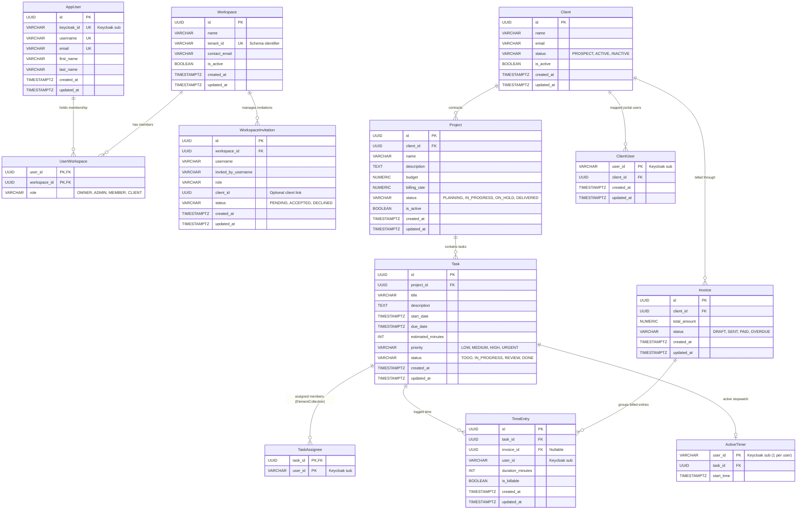

# Agency OS — Database Architecture & Data Model

Agency OS employs a **Schema-per-Tenant** PostgreSQL database architecture.

---

## 1. Schema Separation Strategy

```
PostgreSQL Database Instance: "agency_os"
│
├── public schema (Global shared catalog)
│   ├── app_users
│   ├── workspaces
│   ├── user_workspaces
│   ├── workspace_invitations
│   └── flyway_schema_history
│
├── tenant_acme_agency_1a2b3c (Tenant schema)
│   ├── clients
│   ├── client_users
│   ├── projects
│   ├── tasks
│   ├── task_assignees
│   ├── time_entries
│   ├── active_timers
│   ├── invoices
│   └── flyway_schema_history
│
└── tenant_... (Additional isolated tenant schemas)
```

---

## 2. Public Schema Tables

### `app_users`
Stores user identity profiles synchronized from Keycloak JWT claims.

| Column | Type | Constraints | Description |
|---|---|---|---|
| `id` | `UUID` | `PRIMARY KEY` | Internal application UUID |
| `keycloak_id` | `VARCHAR(255)` | `NOT NULL, UNIQUE` | `sub` claim from Keycloak token |
| `username` | `VARCHAR(255)` | `NOT NULL, UNIQUE` | User's unique handle |
| `email` | `VARCHAR(255)` | `NOT NULL, UNIQUE` | User's email address |
| `first_name` | `VARCHAR(255)` | `NULL` | First name |
| `last_name` | `VARCHAR(255)` | `NULL` | Last name |
| `created_at` | `TIMESTAMPTZ` | `NOT NULL` | Audit timestamp |
| `updated_at` | `TIMESTAMPTZ` | `NOT NULL` | Audit timestamp |

---

### `workspaces`
Stores organization tenants.

| Column | Type | Constraints | Description |
|---|---|---|---|
| `id` | `UUID` | `PRIMARY KEY` | Workspace ID |
| `name` | `VARCHAR(255)` | `NOT NULL` | Organization display name |
| `tenant_id` | `VARCHAR(255)` | `NOT NULL, UNIQUE` | PostgreSQL schema name (e.g. `tenant_acme_1a2b3c`) |
| `contact_email` | `VARCHAR(255)` | `NOT NULL` | Organization admin email |
| `is_active` | `BOOLEAN` | `DEFAULT true` | Soft-deletion flag (`@SQLRestriction("is_active = true")`) |
| `created_at` | `TIMESTAMPTZ` | `NOT NULL` | Audit timestamp |
| `updated_at` | `TIMESTAMPTZ` | `NOT NULL` | Audit timestamp |

---

### `user_workspaces`
Join table mapping users to workspaces with RBAC permissions.

| Column | Type | Constraints | Description |
|---|---|---|---|
| `user_id` | `UUID` | `FK -> app_users(id)` | Composite PK part 1 |
| `workspace_id` | `UUID` | `FK -> workspaces(id)` | Composite PK part 2 |
| `role` | `VARCHAR(50)` | `NOT NULL` | `OWNER`, `ADMIN`, `MEMBER`, `CLIENT` |

---

### `workspace_invitations`
Pending workspace invitations sent to users.

| Column | Type | Constraints | Description |
|---|---|---|---|
| `id` | `UUID` | `PRIMARY KEY` | Invitation ID |
| `workspace_id` | `UUID` | `FK -> workspaces(id)` | Target workspace |
| `username` | `VARCHAR(255)` | `NOT NULL` | Invitee handle or email |
| `invited_by_username` | `VARCHAR(255)` | `NOT NULL` | Username of inviter |
| `role` | `VARCHAR(50)` | `NOT NULL` | Assigned role upon acceptance |
| `client_id` | `UUID` | `NULL` | Associated client ID if role is `CLIENT` |
| `status` | `VARCHAR(50)` | `DEFAULT 'PENDING'` | `PENDING`, `ACCEPTED`, `DECLINED` |
| `created_at` | `TIMESTAMPTZ` | `NOT NULL` | Audit timestamp |
| `updated_at` | `TIMESTAMPTZ` | `NOT NULL` | Audit timestamp |

---

## 3. Tenant Schema Tables (`tenant_*`)

### `clients`
Client company profiles.

| Column | Type | Constraints | Description |
|---|---|---|---|
| `id` | `UUID` | `PRIMARY KEY` | Client UUID |
| `name` | `VARCHAR(255)` | `NOT NULL` | Company Name |
| `email` | `VARCHAR(255)` | `NULL` | Billing Contact Email |
| `status` | `VARCHAR(20)` | `DEFAULT 'PROSPECT'` | `PROSPECT`, `ACTIVE`, `INACTIVE` |
| `is_active` | `BOOLEAN` | `DEFAULT true` | Soft-deletion flag |
| `created_at` | `TIMESTAMPTZ` | `NOT NULL` | Audit timestamp |
| `updated_at` | `TIMESTAMPTZ` | `NOT NULL` | Audit timestamp |

---

### `client_users`
Maps external Keycloak users with the `CLIENT` role to specific client company records.

| Column | Type | Constraints | Description |
|---|---|---|---|
| `user_id` | `VARCHAR(255)` | `PRIMARY KEY` | Keycloak user UUID (`sub` claim) |
| `client_id` | `UUID` | `FK -> clients(id)` | Linked client company |
| `created_at` | `TIMESTAMPTZ` | `NOT NULL` | Audit timestamp |
| `updated_at` | `TIMESTAMPTZ` | `NOT NULL` | Audit timestamp |

---

### `projects`
Project deliverables, budgets, and billing rates.

| Column | Type | Constraints | Description |
|---|---|---|---|
| `id` | `UUID` | `PRIMARY KEY` | Project UUID |
| `client_id` | `UUID` | `FK -> clients(id)` | Associated client (required) |
| `name` | `VARCHAR(100)` | `NOT NULL` | Project title |
| `description` | `TEXT` | `NULL` | Optional project description |
| `budget` | `NUMERIC(12,2)` | `DEFAULT 0.00` | Budget amount |
| `billing_rate` | `NUMERIC(12,2)` | `DEFAULT 100.00` | Default hourly billing rate for tasks |
| `status` | `VARCHAR(20)` | `DEFAULT 'PLANNING'` | `PLANNING`, `IN_PROGRESS`, `ON_HOLD`, `DELIVERED` |
| `is_active` | `BOOLEAN` | `DEFAULT true` | Soft-deletion flag |
| `created_at` | `TIMESTAMPTZ` | `NOT NULL` | Audit timestamp |
| `updated_at` | `TIMESTAMPTZ` | `NOT NULL` | Audit timestamp |

---

### `tasks`
Work tasks scheduled under projects.

| Column | Type | Constraints | Description |
|---|---|---|---|
| `id` | `UUID` | `PRIMARY KEY` | Task UUID |
| `project_id` | `UUID` | `FK -> projects(id)` | Parent project |
| `title` | `VARCHAR(255)` | `NOT NULL` | Task title |
| `description` | `TEXT` | `NULL` | Task description |
| `start_date` | `TIMESTAMPTZ` | `NULL` | Planned start instant |
| `due_date` | `TIMESTAMPTZ` | `NULL` | Due deadline instant |
| `estimated_minutes` | `INT` | `DEFAULT 0` | Estimated duration in minutes |
| `priority` | `VARCHAR(20)` | `DEFAULT 'MEDIUM'` | `LOW`, `MEDIUM`, `HIGH`, `URGENT` |
| `status` | `VARCHAR(20)` | `DEFAULT 'TODO'` | `TODO`, `IN_PROGRESS`, `REVIEW`, `DONE` |
| `created_at` | `TIMESTAMPTZ` | `NOT NULL` | Audit timestamp |
| `updated_at` | `TIMESTAMPTZ` | `NOT NULL` | Audit timestamp |

---

### `task_assignees`
Element collection join table storing assignee Keycloak User IDs (`sub` claims).

> [!NOTE]
> In JPA, this table is mapped as `@ElementCollection` inside `Task.java`. It connects each task to one or more member Keycloak user IDs without requiring a physical cross-schema foreign key constraint.

| Column | Type | Constraints | Description |
|---|---|---|---|
| `task_id` | `UUID` | `FK -> tasks(id) ON DELETE CASCADE` | Composite PK part 1 |
| `user_id` | `VARCHAR(255)` | `NOT NULL` | Composite PK part 2 (Keycloak User `sub` ID) |

---

### `time_entries`
Logged time records against tasks.

| Column | Type | Constraints | Description |
|---|---|---|---|
| `id` | `UUID` | `PRIMARY KEY` | Time entry UUID |
| `task_id` | `UUID` | `FK -> tasks(id) ON DELETE CASCADE` | Associated task |
| `user_id` | `VARCHAR(255)` | `NOT NULL` | Keycloak ID of logger (`sub` claim) |
| `duration_minutes` | `INT` | `NOT NULL, > 0` | Duration in minutes |
| `is_billable` | `BOOLEAN` | `DEFAULT true` | Billing eligibility flag |
| `invoice_id` | `UUID` | `FK -> invoices(id) ON DELETE SET NULL` | Linked invoice once billed |
| `created_at` | `TIMESTAMPTZ` | `NOT NULL` | Audit timestamp |
| `updated_at` | `TIMESTAMPTZ` | `NOT NULL` | Audit timestamp |

---

### `active_timers`
Real-time active stopwatches currently running.

| Column | Type | Constraints | Description |
|---|---|---|---|
| `user_id` | `VARCHAR(255)` | `PRIMARY KEY` | Keycloak User ID (Enforces 1 timer per user) |
| `task_id` | `UUID` | `FK -> tasks(id) ON DELETE CASCADE` | Task being timed |
| `start_time` | `TIMESTAMPTZ` | `NOT NULL` | UTC stopwatch start instant |

---

### `invoices`
Billing invoices generated from unbilled time logs.

| Column | Type | Constraints | Description |
|---|---|---|---|
| `id` | `UUID` | `PRIMARY KEY` | Invoice UUID |
| `client_id` | `UUID` | `FK -> clients(id) ON DELETE RESTRICT` | Billed client |
| `total_amount` | `NUMERIC(12,2)` | `NOT NULL, DEFAULT 0` | Computed invoice total |
| `status` | `VARCHAR(20)` | `DEFAULT 'DRAFT'` | `DRAFT`, `SENT`, `PAID`, `OVERDUE` |
| `created_at` | `TIMESTAMPTZ` | `NOT NULL` | Audit timestamp |
| `updated_at` | `TIMESTAMPTZ` | `NOT NULL` | Audit timestamp |

---

## 4. Entity Relationship Diagram (ERD)



---

## 5. Cross-Schema Linkages & Resolution Patterns

Due to PostgreSQL multi-tenancy boundaries, dynamic `tenant_*` schemas do not maintain physical SQL foreign key constraints to the `public` schema. Instead, linkages are maintained logically:

1. **User Identity Linking**:
   - `task_assignees.user_id` stores the Keycloak user ID (`sub`), referenced in queries via `@ElementCollection`.
   - `time_entries.user_id` and `active_timers.user_id` store the Keycloak user ID (`sub`).
   - `client_users.user_id` stores the Keycloak user ID (`sub`) to bind portal users with the `CLIENT` role to their company profile.
2. **Access Control Filtering**:
   - `MEMBER` users are filtered at the repository/service layer using `task_assignees` to only view and update tasks and projects they are assigned to.
   - `CLIENT` users are resolved through `client_users` to only view their company's projects and invoices.
